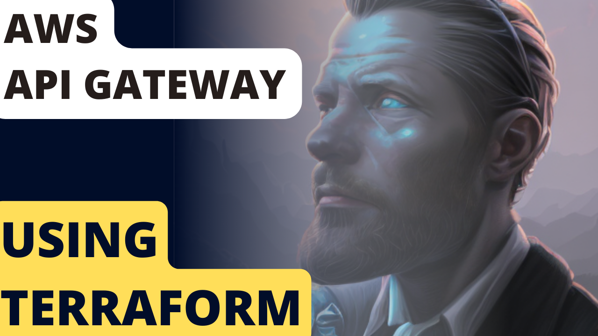

# AWS APIGateway
This module allows you to quickly boot up aws api gateway


## What is AWS CodePipeline/CodeBuild and how does it work?
Most of the answers you are looking for is in this video that specifically covers these modules
[](https://youtu.be/55JnqNeHcQU)

## How to use it:
```
module "dev_env" {
  source = "../modules/apigateway-env"
  env = "dev"
  acm_cert_arn = local.acm_cert_arn
  api_gateway_id = aws_api_gateway_rest_api.api_gateway.id
  hosted_zone_id = local.default_hosted_zone_id
  hosted_zone_name = local.default_hosted_zone_name
  xray_tracing_enabled=true
  //vpc_id = module.vpc.vpc_id
  //private_subnet_mappings = module.vpc.private_subnet_mappings
  //bastion_security_group = module.vpc.bastion_security_group
  //ecs_task_execution_iam_role = aws_iam_role.ecs_task_execution_iam_role

}
```


### Support:
Interested in supporting me as I maintain these free scripts? Click the link below:

<a href="https://www.buymeacoffee.com/schematical" target="_blank">
    
</a>


### Need Help:

#### Jump On The Discord:
This stuff can be a bit complex. Luckily we have a small community of people that like to help.
So head on over to the [Discord](https://discord.gg/F6cErPe6VJ) and feel free to ask any questions you might have.

#### Need more help:
I do consult on this so feel free to hop on over to [Schematical.com](https://schematical.com?utm_source=github_sc-terraform-cicd) and signup for a consultation.


