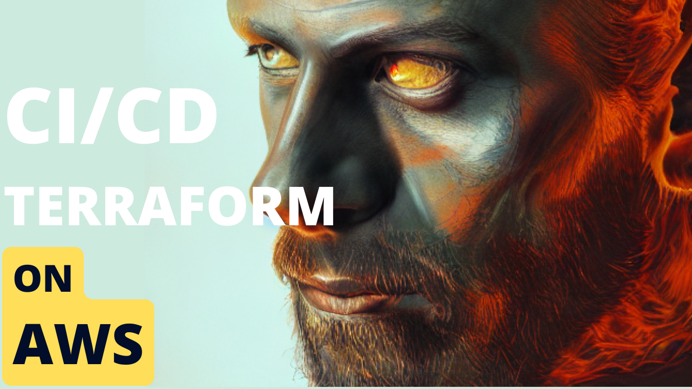

# AWS Build Pipeline Module
This module allows you to quickly boot up a build pipeline that automatically reads from a Github repo and then runs any build commands in the `buildspec.yml` to allow you to build, test and deploy your code quickly.


## What is AWS CodePipeline/CodeBuild and how does it work?
Most of the answers you are looking for is in this video that specifically covers these modules
[](https://youtu.be/55JnqNeHcQU)

## How to use it:
```
module "buildpipeline" {
  source = "github.com/schematical/sc-terraform/modules/buildpipeline"
  service_name = "chaospixel-v1"
  region = var.region
  env = var.env
  github_owner = "schematical"
  github_project_name = "chaos-pixel"
  github_source_branch = var.env
  code_pipeline_artifact_store_bucket = var.codepipeline_artifact_store_bucket.bucket # create this and pass it in.
  vpc_id = var.vpc_id
  private_subnet_mappings = var.private_subnet_mappings # see github.com/schematical/sc-terraform/modules/vpc for this
  source_buildspec_path = "buildspec.yml"
  env_vars =  {
    NODE_ENV: var.env
  }
}
```


### Support:
Interested in supporting me as I maintain these free scripts? Click the link below:

<a href="https://www.buymeacoffee.com/schematical" target="_blank">
    
</a>


### Need Help:

#### Jump On The Discord:
This stuff can be a bit complex. Luckily we have a small community of people that like to help.
So head on over to the [Discord](https://discord.gg/F6cErPe6VJ) and feel free to ask any questions you might have.

#### Need more help:
I do consult on this so feel free to hop on over to [Schematical.com](https://schematical.com?utm_source=github_sc-terraform-cicd) and signup for a consultation.


