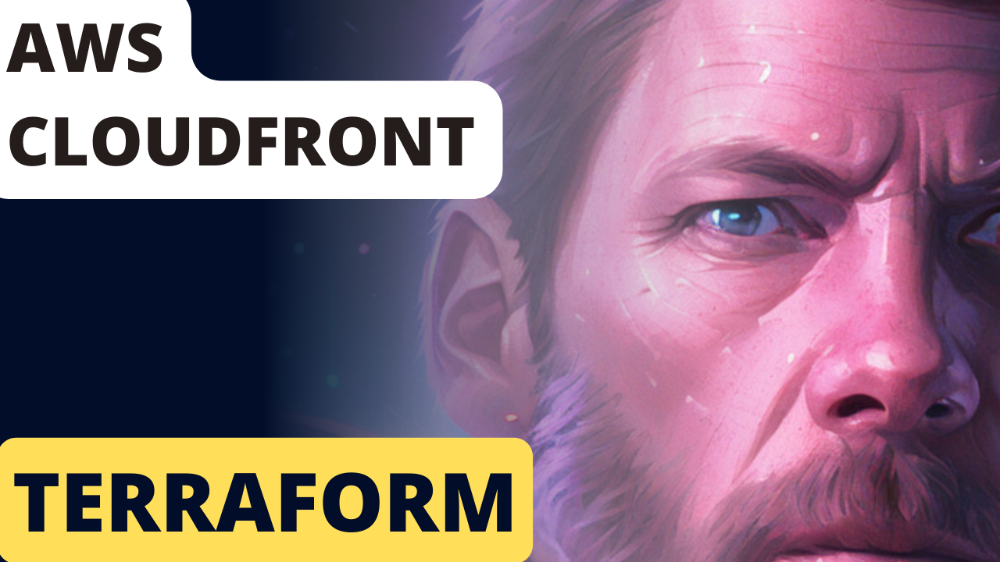

# AWS CloudFront
This module allows you to quickly boot up an AWS CloudFront CDN to quickly and cost efficiently serve up static assets for your website.

## How does it work?
Most of the answers you are looking for is in this video that specifically covers these modules
[](https://youtu.be/0WVFvI69PnE)

## How to use it:
```
module "cloudfront" {
  service_name = "schematical-com-v1"
  source = "../../../../modules/cloudfront"
  region = var.region
  env = var.env
  subdomain = "assets-${var.env}"
  vpc_id = var.vpc_id
  private_subnet_mappings = var.private_subnet_mappings
  hosted_zone_id = var.hosted_zone_id
  hosted_zone_name = var.hosted_zone_name
  acm_cert_arn = var.acm_cert_arn
  codepipeline_artifact_store_bucket = var.codepipeline_artifact_store_bucket
  cors_allowed_hosts = [
    "${var.domain_name}.${var.hosted_zone_name}",
    var.hosted_zone_name
  ]
}
```


### Support:
Interested in supporting me as I maintain these free scripts? Click the link below:

<a href="https://www.buymeacoffee.com/schematical" target="_blank">
    
</a>


### Need Help:

#### Jump On The Discord:
This stuff can be a bit complex. Luckily we have a small community of people that like to help.
So head on over to the [Discord](https://discord.gg/F6cErPe6VJ) and feel free to ask any questions you might have.

#### Need more help:
I do consult on this so feel free to hop on over to [Schematical.com](https://schematical.com?utm_source=github_sc-terraform-cicd) and signup for a consultation.


