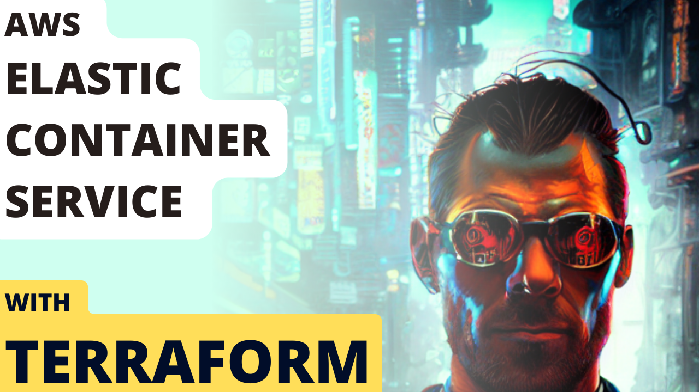

# AWS ECS Service
This allows you to spin up an AWS ECS Service


## What is an AWS VPC and how does it work?
Most of the answers you are looking for is in this video that specifically covers these modules
[](https://www.youtube.com/watch?v=2nShwCkPDDo)

## How to use it:
```
module "ecs_service" {
  source = "git::https://github.com/schematical/sc-terraform.git//modules/ecs-service"
  env = "prod"
  vpc_id = var.env_info.vpc_id
  service_name = "sogotp-com-v1"
  ecs_desired_task_count = 1
  private_subnet_mappings = var.env_info.private_subnet_mappings
  // aws_lb_target_group_arns = [module.prod_env_shiporgetoffthepot_com_tg.aws_lb_target_group_arn]
  ecs_cluster_id = var.env_info.ecs_cluster.id
  ingress_security_groups = [
    var.env_info.shared_alb.alb_sg_id
  ]
  ecr_image_uri = "${aws_ecr_repository.prod_ecr_repo.repository_url}:${var.env}"
  container_port = 80
  create_secrets = false
  task_definition_environment_vars = [{
    name: "NODE_ENV ",
    value: var.env
  }]
```


### Support:
Interested in supporting me as I maintain these free scripts? Click the link below:

<a href="https://www.buymeacoffee.com/schematical" target="_blank">
    
</a>


### Need Help:

#### Jump On The Discord:
This stuff can be a bit complex. Luckily we have a small community of people that like to help.
So head on over to the [Discord](https://discord.gg/F6cErPe6VJ) and feel free to ask any questions you might have.

#### Need more help:
I do consult on this so feel free to hop on over to [Schematical.com](https://schematical.com?utm_source=github_sc-terraform-vpc) and signup for a consultation.  

