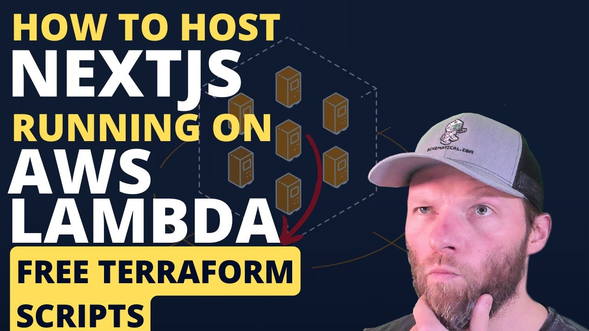

https://youtu.be/G9VdHf3O4Vw

# NextJS On AWS Lambda 
This module allows you to quickly boot up an AWS Lambda MicroService with IAM Roles and Security Groups designed to run with NextJS.
Additionally, it will spin up CloudFront as a CDN to serve up static assets faster and cost efficiently.

## How does it work?
Most of the answers you are looking for is in this video that specifically covers these modules

### Support:
Interested in supporting me as I maintain these free scripts? Click the link below:

### Need Help:

#### Jump On The Discord:
This stuff can be a bit complex. Luckily we have a small community of people that like to help.
So head on over to the [Discord](https://discord.gg/F6cErPe6VJ) and feel free to ask any questions you might have.

#### Need more help:
I do consult on this so feel free to hop on over to [Schematical.com](https://schematical.com?utm_source=github_sc-terraform-cicd) and signup for a consultation.

